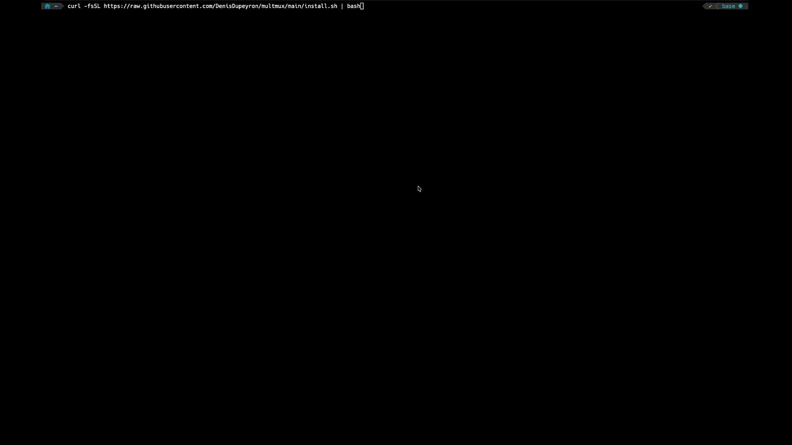

# `multmux`



Multitask in your terminal like you've never before, with no required knowledge of `tmux`.

`multmux` creates a layout with:
- A **main pane** (left, 60% width by default) running multiple inner sessions you can switch between
- **Overflow panes** (right, stacked vertically, 3 by default) for monitoring, quick commands, etc., which persist across session switches

```
┌────────────────────── Outer session ───────────────────────┬──────────────────────┐
│                                                            │                      │
│  ┌────────────────── Inner sessions ────────────────────┐  │                      │
│  │                                                      │  │      Overflow 1      │
│  │                                                      │  │                      │
│  │                                                      │  │                      │
│  │                                                      │  ├──────────────────────┤
│  │                                                      │  │                      │
│  │                                                      │  │                      │
│  │                                                      │  │      Overflow 2      │
│  │                                                      │  │                      │
│  │                                                      │  │                      │
│  │                                                      │  ├──────────────────────┤
│  │                                                      │  │                      │
│  │                                                      │  │                      │
│  │                                                      │  │      Overflow 3      │
│  └──────────────────────────────────────────────────────┘  │                      │
│                                                            │                      │
└────────────────────────────────────────────────────────────┴──────────────────────┘
```

Use your mouse to click on a line separator and resize panes, click in a pane to select/activate it. Then:
- `ctrl+b z` to zoom in and out of a pane
- `ctrl+a s` then up and down arrow and hit `return` on the session you want to select for the main pane (you may need to click on the main pane to activate it first)

All `tmux` shortcuts and configurations work in `multmux` for advanced users.

## One-line install

```bash
curl -fsSL https://raw.githubusercontent.com/DenisDupeyron/multmux/main/install.sh | bash
```

Or:

```bash
wget -qO- https://raw.githubusercontent.com/DenisDupeyron/multmux/main/install.sh | bash
```

### Requirements

- `bash` >= 4
- `tmux` >= 3.2
- `curl` or `wget`

## Usage

```bash
multmux start [--no-attach]   # Start multmux (idempotent)
multmux stop                  # Stop all sessions (asks for confirmation)
multmux attach                # Attach to the outer session (idempotent)
multmux detach                # Detach from multmux, from anywhere (idempotent)
multmux add [path]            # Add a new inner session starting at an optional path (default: START_DIR) and switch to it
multmux remove                # Remove the current inner session
multmux rename <name>         # Rename the current inner session
multmux status                # Show outer/inner running state and inner sessions
multmux reset-layout          # Reset outer pane geometry to configured sizes
multmux update [--dry-run]    # Update multmux to the latest version
multmux uninstall [--config]  # Remove multmux files and optionally the configuration (asks for confirmation)
multmux help                  # Show help
```

## Configuration

The configuration is at `~/.config/multmux.conf`. A [default version](defaults/multmux.conf) is copied there on first install.

It's a sourced bash file to avoid having to create a parser, which makes the code a lot simpler and more maintainable.

All variables are explained in details in the file itself. 

## Session naming

By default, inner sessions are named after their current directory, and automatically renamed whenever you `cd`:
- Your home directory is shown as `~/`
- Full paths and path segments get truncated when they go over configurable limits (see [`multmux.conf`](defaults/multmux.conf))
- If two sessions would end up with the same name, the newer one gets `-1`, `-2`, etc. appended
- Some characters are replaced to avoid clashing with `tmux`

You can rename a session manually with `multmux rename`, at which point the name will stop following its directory.

### Shell completion

Bash and zsh completion for `multmux`'s subcommands is installed automatically.

When using Oh My Zsh, the `fpath` line the installer asks you to add must go **before** `source $ZSH/oh-my-zsh.sh`, since that's where Oh My Zsh calls `compinit` internally.

## Architecture

```
Terminal
└── tmux (socket: multmux-outer)
    ├── Pane 0 (main, left 60%)
    │   └── tmux attach (socket: multmux-inner)
    │       ├── ~/ (named after its cwd, see Session naming)
    │       ├── ~/-1
    │       ├── ...
    │       └── ~/-9
    ├── Pane 1 (overflow)
    ├── Pane 2 (overflow)
    └── Pane 3 (overflow)
```

Two sockets ensure:
1. No infinite nesting: outer and inner are completely isolated
2. No conflict with the user's own `tmux` sessions (default socket untouched)
3. Commands like `multmux stop` can safely kill one server without affecting the other or the user's sessions

## Development

The socket names (`multmux-outer`/`multmux-inner`) can be overridden with environment variables, useful for testing without touching a real, running multmux session:

```bash
MULTMUX_OUTER_SOCKET=multmux-outer-test MULTMUX_INNER_SOCKET=multmux-inner-test ./multmux
```

The test suite uses [bats-core](https://github.com/bats-core/bats-core):

```bash
bats tests/unit          # pure-logic tests, no tmux, fast
bats tests/integration   # real tmux against throwaway sockets/config, slower
bats tests/unit tests/integration   # everything
```

See `tests/README.md` for what each suite covers and the specific failure modes tested.
